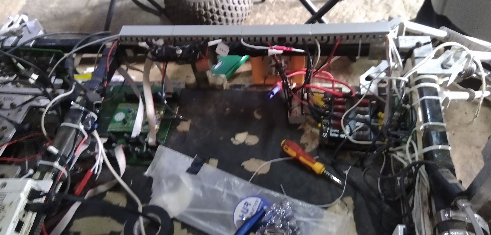
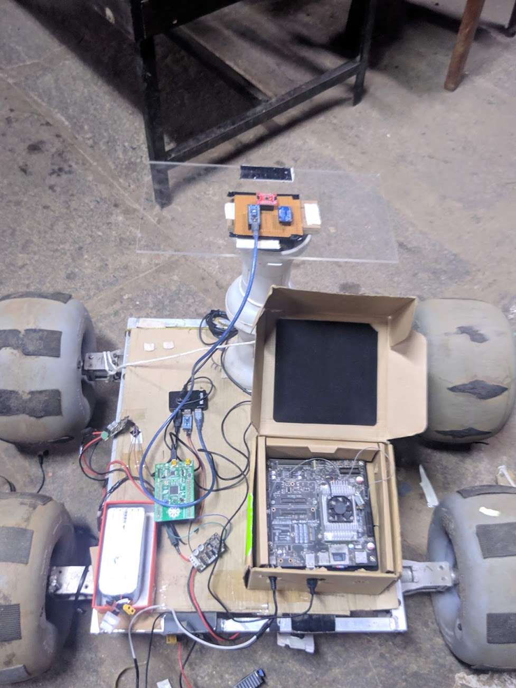
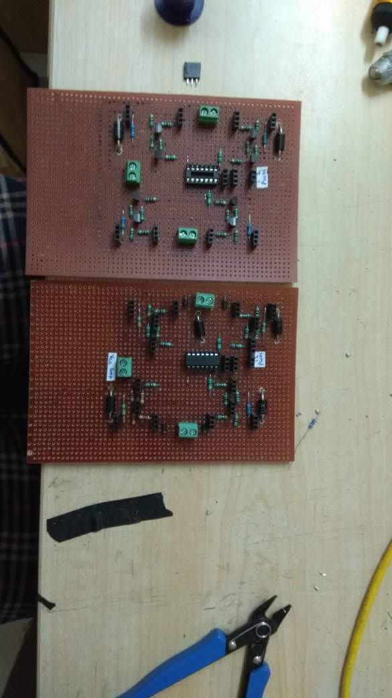
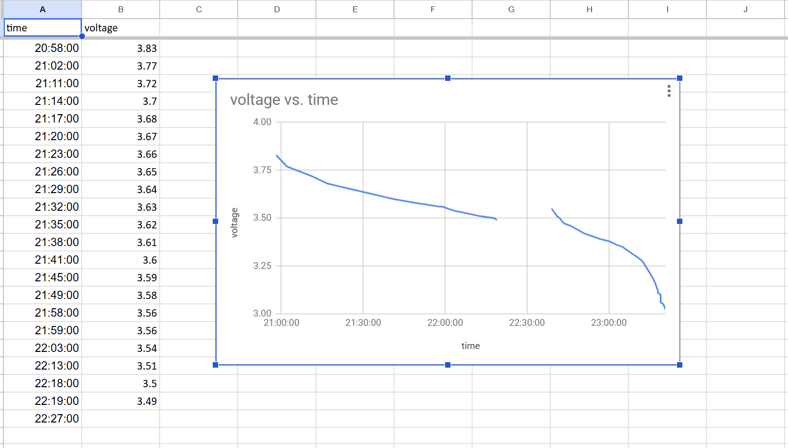
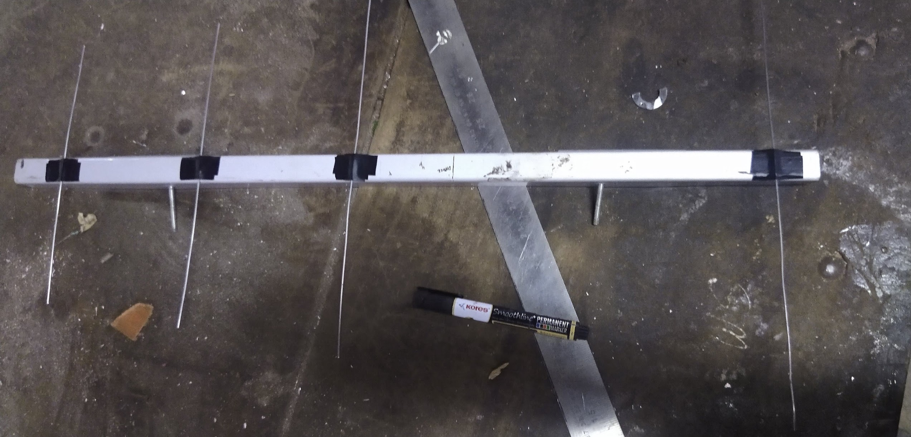

# Electronics Hardware Portfolio

Hands-on electronics and systems work spanning **robotics, PCB design, embedded control, power electronics, wiring/harness integration, test engineering, and hardware prototyping**.

Most material here comes from student engineering projects, Mars Rover Manipal, and university work from roughly 2019–2021. I have kept the original project evidence where useful, while adding context so that old prototypes and reports are not mistaken for current production designs.

> **Professional/confidential work is intentionally not published here.**  
> This repository is a public portfolio of work that I can share.

---

## Selected hardware

| Rover electronics & integration | STM32 / subsystem PCB design |
|---|---|
|  |  |
| System-level electronics integration, power distribution, wiring and subsystem packaging on the rover. | Custom rover subsystem/interface PCB developed around STM32-based control and distributed interfaces. |

| Indoor integration test mule | Discrete motor-driver hardware |
|---|---|
|  |  |
| Indoor Jetson/STM32 test platform built so software, networking and video functionality could be tested without repeatedly deploying the full rover. | Discrete H-bridge motor-driver prototypes developed through simulation, breadboard testing and hand-built perfboard hardware. |

| Battery characterization | Yagi-Uda antenna |
|---|---|
|  |  |
| Constant-current discharge testing used to obtain experimental battery voltage-vs-time behaviour. | Student-built directional antenna prototype following Yagi-Uda element-spacing and length calculations. |

---

## What is in this repository

### PCB & electronics design

Examples include rover interface boards, motor-control hardware and other student PCB work.

Representative images:

- [STM32 rover subsystem/interface PCB](images/pcb/01_stm32_rover_subsystem_interface_pcb_layout.png)
- [MRM custom PCB family](images/pcb/02_mrm_custom_pcb_family_and_components.png)
- [Discrete motor-driver PCB layout](images/pcb/03_discrete_motor_driver_pcb_layout_render.png)

The original PCB/CAD source packages are being cleaned and checked for provenance before being added publicly. Some historical projects used third-party/imported footprints or component libraries, so I do not present every library item as my own work.

### Rover electronics & system integration

My Mars Rover Manipal work included electronics design and maintenance across:

- custom PCBs and subsystem interfaces;
- STM32-based control hardware;
- Jetson/MCU integration;
- power distribution and high-current wiring;
- CAN/UART and other embedded interfaces;
- motor-controller integration;
- harness fabrication and connector selection;
- electronics-box integration and troubleshooting;
- test fixtures and an indoor subsystem test mule.

Images:

- [Rover electronics box](images/rover/01_rover_electronics_box_open_chassis_integration.png)
- [Indoor Jetson/STM32 integration mule](images/rover/02_indoor_jetson_stm32_integration_test_mule.png)
- [Rover electronics / power distribution](images/rover/03_rover_electronics_top_view_power_dist_6f07b4c.png)

### Motor control & prototyping

A recurring part of my early electronics work was building motor-control hardware from the transistor level upward.

The archive includes:

- discrete BJT H-bridge simulations;
- breadboard prototypes;
- perfboard implementations;
- extensive hand rework;
- joystick-based differential-drive control experiments;
- instrumented Proteus simulations used to inspect individual device/node behaviour.

See:

- [Instrumented H-bridge simulation](images/motor/05_discrete_hbridge_instrumented_proteus_simulation.png)
- [Motor-driver breadboard](images/motor/04_discrete_motor_driver_breadboard_prototype.png)
- [Perfboard implementation](images/motor/02_discrete_motor_driver_perfboards_top_side.png)
- [Bottom-side rework](images/motor/03_discrete_motor_driver_perfboard_bottom_rework.png)

### Battery test hardware & analogue instrumentation

I built a simple adjustable electronic load originally to characterize battery discharge behaviour.

The surviving material shows:

- a low-resistance shunt implementation;
- separate voltage-sense wiring across the shunt;
- analogue gain calibration;
- an adjustable power stage;
- manual/logged battery voltage measurements;
- the resulting discharge curve.

See:

- [Load control sketch](images/battery/03_constant_current_load_pmos_bjt_hand_schematic.png)
- [Shunt/gain calibration notes](images/battery/04_shunt_signal_gain_calibration_notebook.png)
- [Measured battery discharge curve](images/battery/05_battery_constant_current_discharge_voltage_curve.png)

The exact final circuit revision no longer survives, so descriptions here intentionally distinguish what is directly documented from what is reconstructed from old notes and photographs.

### Wiring, harnesses & repair

A large part of rover electronics was practical integration rather than PCB work alone.

This included:

- high-current battery wiring;
- ferrule and connector crimping;
- Anderson-style and other power connectors;
- soldered XT-series connectors;
- ribbon/FRC wiring;
- Ethernet/LAN termination;
- screw-terminal and Wago-style connections;
- wire repair and field rework.

Examples:

- [Prototype power harness](images/harness/03_prototype_power_harness_with_dc_dc_module.png)
- [Power/data splitter adapter](images/harness/02_improvised_power_data_splitter_adapter.png)
- [Connector damage after a momentary LiPo short](images/harness/01_charred_power_connectors_after_momentary_lipo_short.png)

### Digital logic

Early student work also included combinational-logic design implemented directly from logic ICs and on perfboard.

Examples:

- [Multipurpose combinational-logic perfboard](images/logic/01_multipurpose_combinational_logic_perfboard_bottom.png)
- [Proteus logic simulation](images/logic/02_combinational_logic_proteus_simulation.png)
- [Hand-derived logic](images/logic/03_binary_to_excess3_hand_derived_logic.png)

### RF / antenna fabrication

I also designed and physically fabricated a student Yagi-Uda antenna prototype.

- [Build in progress](images/antenna/01_yagi_uda_antenna_build_in_progress.png)
- [Completed antenna](images/antenna/02_yagi_uda_antenna_completed.png)

---

## Reports and documentation

The [`reports_public`](reports_public/) directory contains historical reports and engineering notes that I can share publicly.

These include material on:

- electronics fundamentals;
- motors and motor parameters;
- battery fundamentals;
- antenna comparison and Yagi-Uda design;
- embedded communication protocols and C code;
- connector/fuseholder selection and battery monitoring;
- wire-repair and battery-charging job instructions;
- an academic discrete motor-driver project;
- an HVDC research report.

These documents are retained primarily as **evidence of the engineering work and learning process at the time**. They are not presented as current design standards or polished modern reference material.

The larger Mars Rover system-design report and some internship-era power-electronics reports are being reviewed separately before any public release because of team authorship, provenance and publication considerations.

---

## Context and provenance

This repository intentionally separates:

1. **work I personally designed/built**,  
2. **team-system work where I contributed to the electronics**, and  
3. **historical reports/reference material**.

Mars Rover Manipal was a multidisciplinary team project. Where an image shows the complete rover or electronics box, it represents the team system; the surrounding notes describe the electronics work and subsystems I personally worked on rather than claiming sole authorship of the entire rover.

For a file-by-file description, see:

- [`CAPTIONS.md`](CAPTIONS.md)
- [`IMAGE_INDEX.csv`](IMAGE_INDEX.csv)
- [`REPORT_INDEX.csv`](REPORT_INDEX.csv)
- [`SOURCE_MAP.md`](SOURCE_MAP.md)

---

## Main engineering areas represented

`Electronics` · `PCB Design` · `Embedded Systems` · `Motor Control` · `Power Electronics` · `Hardware Test` · `Failure Analysis` · `Harnessing & Interconnects` · `Robotics` · `MATLAB/Simulink` · `Proteus`

---

## About me

I am an electronics / systems engineer currently completing an MSc in Systems & Control at TU Delft. My professional experience includes regulated medical-device electronics and hardware verification, alongside power-electronics failure analysis and hands-on electronics development.

This repository focuses on public hardware/project material rather than confidential professional work.
