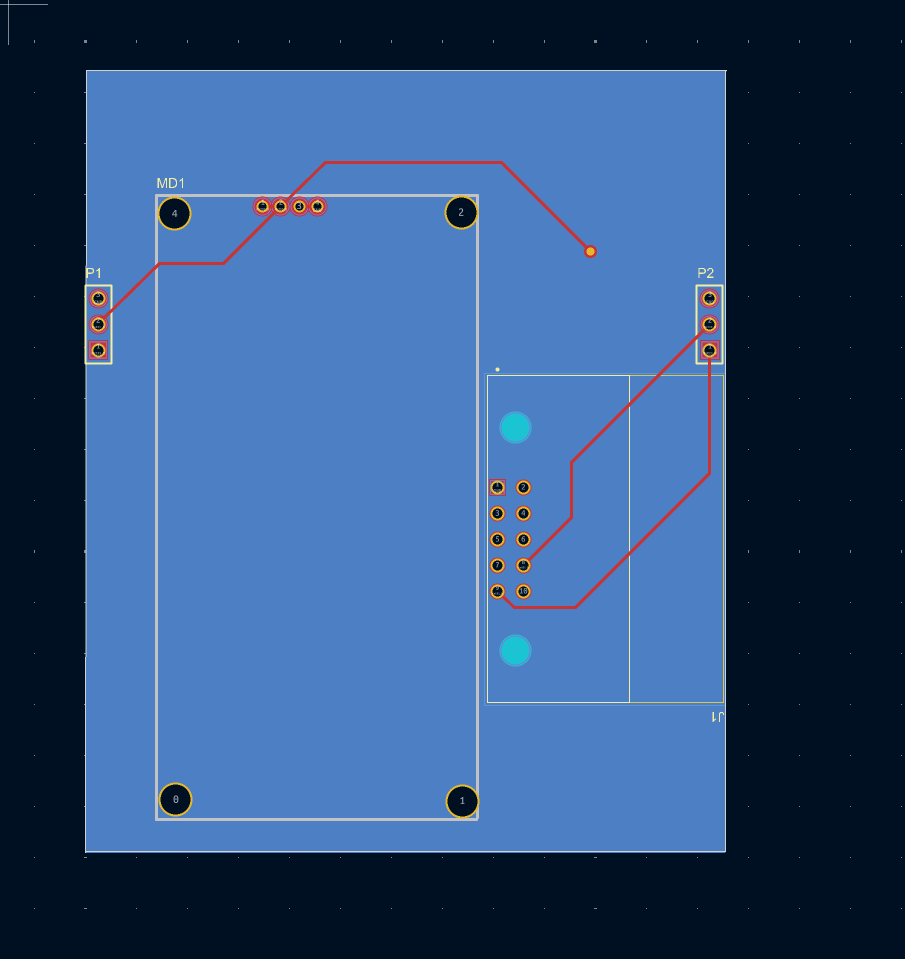

# Modular motor-driver interface PCB

Historical Mars Rover Manipal motor-driver interface.

## Confirmed from the surviving design

The KiCad source contains:

- a motor-driver module footprint;
- a 10-position rover-side connector;
- two 3-pin headers;
- two control nets plus ground.

The control nets are consistent with the PWM + direction interface of the Cytron motor-driver hardware used on the rover. Both 3-pin headers carry the same two control signals and ground, making this surviving revision a compact modular signal-routing/interface board.

An I²C-addressed architecture is **not** claimed for this particular source set because the recovered netlist does not show it.

## Included source

- `source_kicad/` — recovered/converted KiCad project
- `source_altium_legacy/cytron_test_1/` — earlier Altium project snapshot
- `source_altium_legacy/cytron_partial/` — another partial historical Altium snapshot
- `media/` — recovered layout image

Third-party connector library files found in the old archives are omitted from the public-ready package; see `THIRD_PARTY_LIBRARY_NOTICE.md`.
