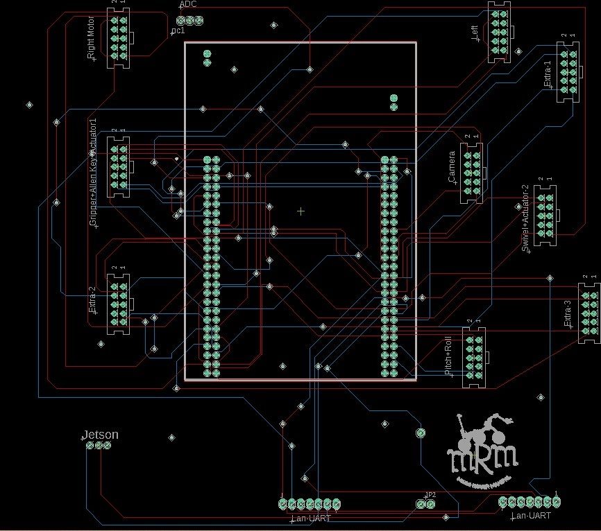

# STM32 rover subsystem / interface PCB

Historical Mars Rover Manipal interface-board project built around an STM32F3 Discovery controller.

## What the surviving design shows

The main Altium project contains a large STM32-based subsystem/interface board with multiple 10-position AMP-Latch/IDC-style connectors. Surviving schematic labels include rover functions such as arm and motor interfaces, and the MCU breakout exposes GPIO and alternate-function resources used across embedded interfaces.

From the project history, the board was intended to consolidate rover subsystem wiring and make interfaces more modular and serviceable. I also deliberately considered connector-reversal failure modes in the rover interface design; that design context is documented separately from the raw CAD files.

## Public source included

- `source_altium/STM32.PrjPcb`
- `source_altium/STM321.SchDoc`
- `source_altium/STM321.SWPcbDoc`

Two older loose schematic sheets from the historical folder are retained under `source_altium/unresolved_legacy/` because their exact role in the final revision is no longer certain.

## Library provenance

The original project folder also contained externally sourced connector/development-board libraries. Those libraries are **not** included in this public-ready package because their redistribution terms were not established. Altium documents retain placed-component data, but library relinking may be required for further editing.

See `LIBRARY_REFERENCES.md` for the filenames found in the original project.
