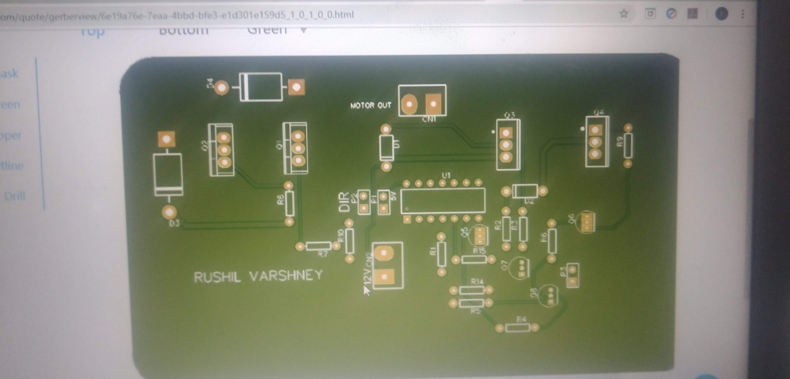

# Discrete BJT H-bridge motor driver

Student motor-control project developed from transistor-level simulation through breadboard/perfboard prototypes and PCB/manufacturing output.

## Evidence in this repository

- discrete H-bridge schematic export;
- manufacturing Gerbers/drill files;
- breadboard and perfboard photographs;
- instrumented Proteus simulation screenshots;
- the university project report under `reports_public/University_and_Research_Reports/`.

## Authorship note

The surviving schematic export itself lists `bharathajay51` as the drawing author. This is therefore presented as **shared/student-team design work**, consistent with the project history, rather than as a sole-authorship schematic.
